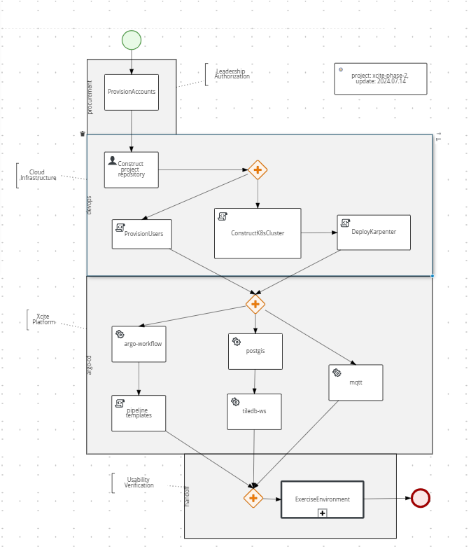

As part of our work to productionize the photogrammetry systems, we need to provide demonstrate capability to instantiate the systems in a repeatable fashion. These systems should then be maintainable using "Continuous Integration and Continuous Delivery (CICD)" methods and tooling. Consider the following "Business Process Model Notation (BPMN)" diagram of this capability depicting four swim lanes of activity: procurement, development operations, continuous deployment and handoff.

# Procurement

To set up a new AWS environment, a structured and detailed approach is essential. The initial step involves provisioning accounts as part of the procurement process. This ensures that all necessary permissions and billing structures are in place, creating a foundation for subsequent tasks.

# DevOPs

Following procurement, the focus shifts to DevOps tasks. This includes constructing the project repository, which will serve as the central hub for all project-related files and resources. Provisioning repository users is another crucial step, ensuring that team members have appropriate access levels to collaborate effectively. Next, a Kubernetes (K8S) cluster needs to be constructed. Kubernetes will orchestrate the deployment, scaling, and management of containerized applications, providing a robust infrastructure for the project. Within this cluster, Karpenter will be deployed to manage the autoscaling of nodes, optimizing resource utilization and ensuring efficient operation of the environment.

# Argo CD

Another critical component is setting up Argo CD for continuous delivery. Argo CD will manage application deployment and lifecycle, ensuring consistent and reproducible environments. Within Argo CD, several specific configurations are required. Argo Workflows need to be set up to define and manage complex workflows and pipelines. This involves creating pipeline templates that outline the various stages and processes involved in the data flow. Additionally, setting up PostGIS is essential for managing spatial and geographic data. This includes configuring a tile database, which will store and serve reconstruciton metadata. MQTT, a lightweight messaging protocol, will also be configured to facilitate efficient communication between devices and applications within the environment; the frontend Hub and various backend services.

# Handoff

Once all components are set up, rigorous testing is necessary to validate the environment. This involves running various test datasets to ensure that each component functions correctly and integrates seamlessly with the others. Using test data, the environment will be exercised, identifying any potential issues and ensuring that the environment meets the project's requirements. Comprehensive testing will ensure a robust and reliable AWS environment ready for production use.